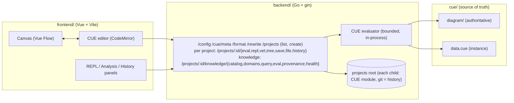

# cueto

> [!WARNING]
> Work in progress. This project is not production-ready. APIs, the schema, and storage formats change without notice.

An evaluation server for diagrams whose single source of truth is CUE. The same value is inferred as a diagram from plain schema and data, edited as code, and queried in a REPL.

Every organization knows things about itself: who is on which team, which services exist, who owns them, what depends on what. Today that knowledge is scattered across wikis and spreadsheets, and nothing checks it, so a page can claim a service is owned by Alice long after Alice has left. cueto converges those facts into one value under a CUE schema and keeps it honest: remove a person and every fact that names them breaks the build instead of going stale. The same compiled value answers questions by evaluation, so an agent wired to it reads exact, grounded facts instead of retrieved text.

## Demo in five minutes

Prerequisites are Go 1.26+, Node with pnpm, and git. The repo ships a demo project, `examples/service-catalog`: a small engineering organization (teams, people, services, ownership, dependencies, roles, deploy environments) as plain CUE, with no diagram authored and nothing imported from cueto.

Start the backend.

```
cp backend/.env.example backend/.env
cd backend
go run ./cmd/server
```

Start the frontend in a second shell.

```
cp frontend/.env.example frontend/.env
cd frontend
pnpm install
pnpm run dev
```

Open http://localhost:5173. The `service-catalog` demo opens by itself - a single project is always the default. You get a rendered graph of the whole organization, 14 nodes and 16 edges, even though the module authors no diagram: cueto infers it from the shapes already in the data. Two views are derived, `model` (one ER-style table per registry) and `instances` (one node per member), each with a legend of the discovered registries and a per-element trace of which detection rule produced it.

### Ask it questions

The REPL panel evaluates any CUE expression against the live model in the editor. Try these.

```
> teams[services.billing.owner].channel
"#team-payments"

> services.storefront.dependsOn
["gateway", "billing"]

> [for id, s in services if s.tier == "critical" {s.name}]
["API Gateway", "Billing", "Ledger"]
```

Every answer comes from the compiled value, checked against the same schema that renders the graph, so a dangling name is a build error rather than a hallucination.

### Roles and deploy configs

The demo also declares who may do what (`access.cue`) and how services run per environment (`deploy.cue`), and both exploit the value lattice CUE is built on. A role is a disjunction, a set of permissions, and unification `&` is the lattice meet: unifying two roles intersects what they allow.

```
> (roles.developer & roles.operator) & "write"
"write"

> _ & "deploy"
"deploy"

> "read" & "admin"
conflicting values "admin" and "read"
```

Top (`_`) permits anything, so it is the identity of the meet, and two disjoint permissions meet at bottom, an error. Configs work the same way as a meet-semilattice: every environment is `configBase & overlay`, the greatest lower bound of both, with defaults filling whatever the overlay leaves open.

```
> configBase & {replicas: 3}
{"replicas": 3, "logLevel": "info", "memoryMb": 256}

> environments.prod
{"replicas": 3, "logLevel": "error", "memoryMb": 1024}
```

There is no template engine and no override precedence table: an environment that contradicts its base is not "last writer wins", it is bottom, a build error.

### Break it

Delete the line declaring `alice` in the editor (or in `examples/service-catalog/catalog.cue`). The build fails at the exact fact that named her:

```
cueto vet: module is not valid:
  services.gateway.techLead: 3 errors in empty disjunction:
  6:17: services.gateway.techLead: conflicting values "bruno" and "alice"
```

That is the whole point: knowledge that cannot silently go stale. The error is the same lattice at work, a fact that names a missing person unifies to bottom, so staleness cannot survive a build. Put the line back and the graph returns.

Canvas and editor stay in sync through a source map, and a save writes the real file on disk. Your edits show up in `git diff`; git is the only history.

## One binary

`cueto serve` runs the whole app - API, embedded web UI, diagram schema, and demo - as one static binary with no checkout, no env file, and no Node. Everything lives under one standard root, `$XDG_DATA_HOME/cueto` when set, else `~/.cueto`:

```
~/.cueto/
  config.cue   optional, hand-edited: port and hardening bounds, schema-validated
  state.json   machine-written: the current project per projects root
  projects/    each child is a git repo plus a CUE module
  schema/      the embedded diagram schema, materialized at startup
```

On first run the projects root is empty, so serve seeds the `service-catalog` demo and the app opens straight into it. Selection follows three rules, and no environment variable ever names a project: a single project is the default; with several, the last selected wins (the web app and `cueto use` write the same state); with several and none selected, you land on the project picker.

Releases are cut manually: run the release workflow from the Actions tab with a version number, and it creates the tag, cross-compiles for linux amd64/arm64 and macOS arm64 with the UI embedded, and publishes a GitHub release with the binaries attached. The binaries workflow runs the same build on pull requests as a check, without publishing anything. To reproduce a binary locally:

```
cd frontend
pnpm install
pnpm run build
rm -rf ../backend/internal/assets/webui
cp -R dist ../backend/internal/assets/webui
cd ../backend
go build -o ../cueto ./cmd/cueto
cd ..
./cueto serve
```

The `webui` copy is build output; do not commit it (the committed placeholder page is what CI overwrites). Flags: `-port` (default 8091, or `port:` in `config.cue`), `-home`, `-projects`, `-cue`.

## Ask it from the CLI

The `cueto` CLI runs the same engine without the server, for CI and agents. Run it from `backend/`.

`catalog` discovers the domains and named evaluations, with fields, types, and relations, so an agent can plan a call without reading any CUE:

```
$ go run ./cmd/cueto catalog -C ../examples/service-catalog
{
  "domains": [
    {"name": "people", "kind": "registry", "fields": {...}},
    {"name": "services", ...},
    {"name": "teams", ...}
  ],
  "evaluations": [
    {"name": "ownerOf", "description": "Which team owns a service, and how to reach them", ...},
    {"name": "blastRadius", "description": "Which services break if this service goes down", ...}
  ]
}
```

`query` runs a bounded, schema-checked filter, never a CUE expression:

```
$ echo '{"domain":"services","select":["name","tier"],"where":[{"field":"owner","operator":"eq","value":"payments"}]}' | go run ./cmd/cueto query - -C ../examples/service-catalog
{
  "result": [
    {"id": "billing", "name": "Billing", "tier": "critical"},
    {"id": "ledger", "name": "Ledger", "tier": "critical"}
  ],
  "count": 2
}
```

`eval` runs one named, schema-validated evaluation against a JSON input:

```
$ echo '{"serviceId":"gateway"}' | go run ./cmd/cueto eval blastRadius --input - -C ../examples/service-catalog
{
  "status": "success",
  "result": {"dependents": ["billing", "storefront"]},
  "evaluation": "blastRadius",
  "revision": "..."
}
```

The `-C` flag is optional everywhere: without it the CLI resolves the same current project the app uses - the working directory when it is itself a CUE module, else `-p <id>`, else the selected (or only) project under the cueto home. `cueto projects` lists what `-p` accepts and stars the current one; `cueto use <id>` switches it.

```
$ go run ./cmd/cueto projects
* service-catalog

$ go run ./cmd/cueto catalog
{ ... the current project's catalog ... }
```

`vet`, `check`, `graph`, `describe`, `get` round out the set (`go run ./cmd/cueto help`). The same operations are served per project over HTTP at `/projects/:id/knowledge/{catalog,domains,query,eval,provenance,health}`. An agent never gets to send arbitrary CUE: only named, bounded operations against the compiled value. Today the app itself wires in the catalog (the Knowledge panel); the rest are CLI and HTTP, for CI and agents.

## How inference works

Detection is by shape only, so the module stays plain CUE that any tool can read.

- A registry, a top-level struct with open string labels like `teams: [ID=string]: #Team`, becomes a set of nodes.
- A field constrained to a registry's key set becomes a relation. The idiom is a disjunction of the keys, `#TeamID: or([for id, _ in teams {id}])`, then `team: #TeamID`. A list field of key-set elements yields one edge per element, like `dependsOn: [...#ServiceID]`. A plain `string` field is not a reference; an explicit `@ref(teams)` attribute is the escape hatch.
- Named entries under a plain `evaluations` field, each with `description`, `input`, and `result`, become the callable evaluations above. No import is required.

See [examples/service-catalog](examples/service-catalog) for the complete module: three files (`catalog.cue`, `access.cue`, `deploy.cue`), around 150 lines of plain CUE that drive everything shown here.

## Architecture



The evaluator is a pure, adapter-independent core: it takes a prepared file set and returns JSON, views, inference trace, and structured diagnostics, under body-size, output-size, per-request deadline, and concurrency bounds. The gin HTTP server and the `cueto` CLI are thin shells around that one core, so a module vets and evaluates identically in the editor and in CI.

- `cue/diagram/` is the hand-owned schema package. It is never rewritten by the app. A project may also author `diagram` views explicitly against it; the canvas round-trips only the data, never the schema.
- Each child directory of the projects root holding a CUE module is a project. `POST /projects` creates one by git-initializing a directory and scaffolding a minimal module, the only time cueto writes git state. Saves write real files under a path guard, never touching git.
- `cueto serve` uses `<home>/projects` as the root; the dev server takes `PROJECTS_DIR` from `.env` (default `../examples`, so the demo is there with zero setup). `GET /session` resolves the current project server-side, and the embedded schema and demo are drift-tested byte-for-byte against `cue/` and `examples/`.

## Validation and tests

Validate the committed modules (this is what CI should run; the `cue` CLI is needed for the first command).

```
cd cue
cue vet ./...
```

```
cd backend
go run ./cmd/cueto vet -C ../cue
go run ./cmd/cueto check -C ../cue
go run ./cmd/cueto vet -C ../examples/service-catalog
go run ./cmd/cueto check -C ../examples/service-catalog
```

`vet` validates the whole module (dangling references, schema and closedness violations) without requiring concreteness. `check` resolves `@file`/`@uri` graph references against the world.

Run the tests.

```
cd backend
go test ./...
```

```
cd frontend
pnpm run test
```

## License

Mozilla Public License v2.0 (MPL v2.0). See [LICENSE](LICENSE). Copyright 2026, Lucas Jahier, Stratorys.
