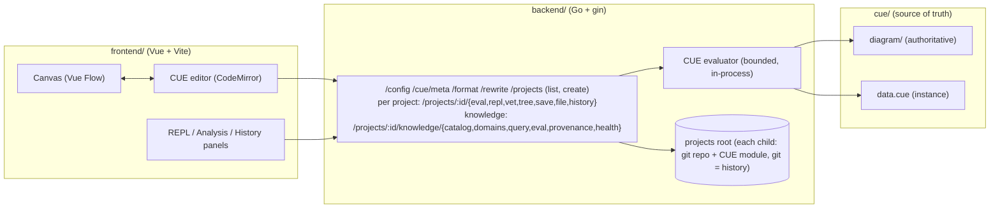

# cueto

> [!WARNING]
> Work in progress. This project is not production-ready. APIs, the schema, and storage formats change without notice.

An evaluation server for diagrams whose single source of truth is CUE. The same value is inferred as a diagram from plain schema and data, edited as code, and queried in a REPL.

## The idea

Every organization knows things about itself. Who is on which team, which services exist, who owns them, what depends on what. Today that knowledge is scattered across wikis, spreadsheets, catalogs, and readme files, and nothing checks it, so a page can claim a service is owned by Alice long after Alice has left. The facts just went stale, because no mechanism forces them to stay true.

Knowledge as code converges those sources into one value under a CUE schema, and cueto is a way to see that value and keep it honest. Because the diagram is the data, references are typed against what the module actually declares, so neither the data nor the schema can drift from the picture. Remove a person and every fact that names them breaks the build rather than lingering as a stale claim.

The same property makes cueto a deterministic retrieval surface for agents. A question is answered by evaluating a CUE expression against the compiled value, so the answer is exact and grounded in what is really declared, unlike RAG, which returns probabilistic passages with no guarantee they are true or current. Because the agent reads one evaluated fact instead of a pile of retrieved text, the context carries fewer tokens, the model's attention stays on what matters, and there is far less room to hallucinate.

## What it demonstrates

- **Inference**. A module of plain schema and data, with no diagram authored, still renders, because cueto derives an entity-relation graph from the integrity idioms you already wrote. See [Inference](#inference).
- **Architecture pattern**. A hand-owned schema package (`cue/diagram/`) that is never machine-written, with a concrete instance (`data.cue`) overlaid per request, so the canvas only ever round-trips the data and the schema stays authoritative.
- **Workflow design**. The same model is edited two ways, a visual canvas and CUE code, kept in sync through a source map, then evaluated, validated, formatted, and saved to real files on disk in the user's own project, with git as the only history.
- **Knowledge model**. The schema separates rendering fields (`type`, `shape`, colors) from a free-form `data` payload, so the nodes you draw carry domain facts you can query.
- **Queryability**. A REPL pane with CUE stdlib introspection and autocompletion evaluates any expression against the live model in the editor.
- **Agent-safe retrieval**. Named domains, bounded Go-side queries, and schema-validated evaluations expose the same compiled value without ever handing an agent arbitrary CUE. See [Knowledge](#knowledge).
- **Observability**. Evaluation returns structured diagnostics with source positions and host paths scrubbed, plus provenance and hints, rather than opaque errors.
- **Production trade-offs**. Untrusted CUE is evaluated in-process under body-size, output-size, per-request deadline, and concurrency bounds, behind explicit server timeouts and graceful shutdown.

## What it is not

This is not a production framework.
This is not a complete product.
This is a reference implementation and design study.

## Inference

Give cueto a module of plain schema and data, with no diagram authored and nothing imported from cueto, and it derives the graph from the integrity idioms you already wrote.

```cue
package main

#Person: {
	name:   string
	mother: string | *""
	father: string | *""
	role:   string | *""
	year:   int
}

people: [ID=string]: #Person
people: {
	george:   {name: "George McFly", role: "parent", year: 1938}
	lorraine: {name: "Lorraine Baines", role: "parent", year: 1938}
	marty:    {name: "Marty McFly", role: "traveler", mother: "lorraine", father: "george", year: 1968}
	dave:     {name: "Dave McFly", role: "sibling", mother: "lorraine", father: "george", year: 1961}
	linda:    {name: "Linda McFly", role: "sibling", mother: "lorraine", father: "george", year: 1965}
	doc:      {name: "Dr. Emmett Brown", role: "inventor", year: 1920}
}
```

From that alone cueto derives the graph.

- A registry, a struct with open string labels like `people`, becomes a set of nodes.
- A field constrained to a registry's key set, such as `mother` or `father`, becomes a relation.
- Two views render the result, `model` drawing each registry as one ER-style type table and `instances` drawing one node per member.
- Every derived view carries a legend of the discovered registries and a per-element trace that records which detection rule produced each node and edge.

Detection is by shape only, so cueto learns no domain vocabulary and the module stays plain CUE that any tool can read.

## Querying

The same value is queryable. The REPL pane evaluates any CUE expression against the live model in the editor, nothing is saved and the schema and files are untouched, so a structured question gets a deterministic answer by evaluation rather than retrieval.

"who is Marty's mother?" is a path lookup rather than a guess.

```
> people[people.marty.mother].name
"Lorraine Baines"
```

The answer comes from the compiled value. `marty.mother` is checked against the same schema that renders the graph, so a dangling name is a build error rather than a hallucination. An agent wired to this endpoint answers from evaluated fact instead of retrieved text, because the graph you draw and the knowledge you query are one CUE value.


<details>
<summary>Authoring a view by hand</summary>

Inference is not required. You can author the `diagram` field explicitly and map the same `people` data into nodes and edges.

```cue
package main

import d "github.com/stratorys/cueto/diagram"

diagram: d.#Diagram & {
	nodes: {
		for pid, p in people {
			(pid): {
				type:  "entity"
				label: p.name
				data: {
					role: p.role
					year: p.year
				}
			}
		}
	}
	edges: [
		for pid, p in people if p.mother != "" {
			{
				id:     "m_\(pid)"
				source: p.mother
				target: pid
				kind:   "arrow"
				label:  "mother"
			}
		},
		for pid, p in people if p.father != "" {
			{
				id:     "f_\(pid)"
				source: p.father
				target: pid
				kind:   "arrow"
				label:  "father"
			}
		},
	]
}
```

</details>

## Knowledge

The REPL answers with a CUE expression, which is expressive but not something to hand an agent: an agent should not be trusted with arbitrary CUE against your module. The knowledge runtime is a fixed set of named operations instead. It requires no import and no extra vocabulary: the same registry and evaluation shapes that drive inference and the REPL are enough. Add one plain `evaluations` field next to the `people` data above:

```cue
evaluations: isTraveler: {
	description: "Check whether a person travels through time"
	input: {personId: string}
	result: {traveler: people[input.personId].role == "traveler"}
}
```

`cueto catalog` (or `GET /projects/:id/knowledge/catalog`) discovers `people` as a domain and `isTraveler` as a named evaluation, with their fields, types, and relations, so an agent can plan a call without ever reading the module's CUE:

```
$ cueto catalog -C cue
{
  "domains": [{"name": "people", "kind": "registry", "fields": {"role": {"type": "string", "required": true}, ...}}],
  "evaluations": [{"name": "isTraveler", "description": "Check whether a person travels through time", ...}]
}
```

`cueto query` (or `POST /projects/:id/knowledge/query`) runs a bounded, schema-checked filter, never a CUE expression:

```
$ echo '{"domain":"people","select":["name"],"where":[{"field":"role","operator":"eq","value":"traveler"}]}' | cueto query - -C cue
{"result": [{"id": "marty", "name": "Marty McFly"}], "count": 1}
```

`cueto eval` (or `POST /projects/:id/knowledge/eval/isTraveler`) runs one named, schema-validated evaluation against a JSON input:

```
$ echo '{"personId":"marty"}' | cueto eval isTraveler --input - -C cue
{"status": "success", "result": {"traveler": true}, "evaluation": "isTraveler", "revision": "..."}
```

Every answer comes from the same compiled value the canvas renders and the REPL queries, so there is no separate index to drift out of sync. `describe`, `get`, `provenance`, and `health` round out the same operation set (see [How it works](#how-it-works) above). Today only the catalog is wired into the app itself, in the Knowledge panel; the rest are CLI and HTTP only, for CI and agents.

## Authoring

The canvas and the CUE editor stay in sync through a source map, so a change in one appears in the other. Canvas edits are spliced back into CUE text through `/rewrite`, and `/format` normalizes the result with `cue fmt`, so the code and the picture never disagree.

## Architecture



The CUE evaluator is a pure, adapter-independent core. It takes a prepared file set and returns JSON, views, inference trace and legend, hints, and diagnostics, under fixed size, output, deadline, and concurrency bounds. It knows nothing about HTTP, disks, or projects. The same engine backs two adapters today, the gin HTTP server and the `cueto` CLI, so a diagram vets and evaluates identically in the editor and in CI. Persistence and transport are thin shells around that one core.

## How it works

1. `cue/diagram/` is the hand-owned schema package (`#Diagram`, `#Node`, `#Column`, `#Edge`). It is never rewritten by the app.
2. `cue/data.cue` is the concrete instance that imports the schema and declares one or more diagram views. The canvas round-trips only this file, and the schema stays fixed.
3. On `/eval`, the backend loads the module fresh from disk, overlays the request's editable files, and unifies them against the schema. It discovers every top-level field that is diagram-shaped, meaning it unifies with `#Diagram` and carries `nodes`, so a module may expose zero, one, or many such **views**, and it returns the selected view's concrete diagram as JSON plus the list of discovered view names, or structured diagnostics on failure. A view must be concrete to render, so `/eval` gates it, while non-view knowledge fields need only be valid. A module that authors no view is not an error, because cueto infers the `model` and `instances` views from the module's registries and key-set references and returns those instead, each with a legend and per-element trace (bounded at `inferNodeMax` nodes and `inferEdgeMax` edges). All under size, output, deadline, and concurrency bounds.
4. Canvas edits are spliced back into CUE text through `/rewrite`, and `/format` normalizes it with `cue fmt`, so the code and the picture never disagree.
5. `/repl` evaluates any CUE expression against the live model in the editor. `/cue/meta` exposes stdlib introspection that powers autocompletion and auto-import.
6. `/vet` validates every package in the module for validity, catching dangling references and schema and closedness violations, and returns structured diagnostics. It never requires concreteness, so an incomplete-but-valid module vets clean while `/eval` gates the rendered view. `make check` runs `cue vet ./...` plus `cueto vet` and `cueto check`, so an invalid committed diagram, or a broken file or URI reference, fails CI.
7. Persistence is git. The server is pointed at a **projects root**, and each child directory is a git repository with its own CUE module. `GET /projects` lists them and `POST /projects` creates one by git-initializing a new directory, scaffolding a minimal vocabulary-free module, and making one initial commit, the only time cueto ever writes git state. Every module-touching operation is scoped to a project, namely `/projects/:id/eval`, `/vet`, `/repl`, `/tree`, `/save`, `/file`, `/history`, and `DELETE /projects/:id/file`.
8. `/projects/:id/save` validates the buffer against the whole module and writes the real file on disk under a path guard, refusing a save when the file changed on disk since it was loaded and never staging, committing, or otherwise mutating git state. `/projects/:id/history` and `/projects/:id/file` read the git log and file blobs read-only to feed the history panel. cueto is not a version store, and git is the only history.
9. The knowledge runtime (`internal/knowledge`) generalizes the same discovery beyond diagrams: `/projects/:id/knowledge/catalog` lists every domain (declared or structurally inferred, same registry detector as inference) and every named `evaluations` entry; `domains/:domain` and `domains/:domain/:key` describe one domain and fetch one record; `query` runs a bounded, Go-side filter against a domain, never arbitrary CUE, so it stays safe for an agent to call; `eval/:name` runs one named, schema-validated evaluation against a JSON input overlay; `provenance` and `health` report where facts are declared and whether the module is valid. See [Knowledge](#knowledge) above. The `cueto catalog|describe|get|query|eval` CLI subcommands run the identical operations outside the server. Today only the catalog is wired into the app (the Knowledge panel lists domains and evaluations); query, eval, provenance, and health are CLI and HTTP only.

## Run locally

Prerequisites are Go 1.26+, the [`cue`](https://cuelang.org) CLI for `make check`, and Node with pnpm.

Start the backend.

```
cp backend/.env.example backend/.env
cd backend
go run ./cmd/server
```

Set `PROJECTS_DIR` to a directory that holds your projects, where each child is a git
repository with its own `cue.mod`. The web app lists them and creates new ones, and the
first is made for you through `git init`. The diagram schema comes from `CUE_DIR`.

Start the frontend in a second shell.

```
cp frontend/.env.example frontend/.env
cd frontend
pnpm install
pnpm run dev
```

Run the architecture CI check.

```
make check
```

Run the tests.

```
cd backend
go test ./...
```

```
cd frontend
pnpm run test
```

## Related writing

- [Coming soon](https://stratorys.com)

## License

Mozilla Public License v2.0 (MPL v2.0). See [LICENSE](LICENSE). Copyright 2026, Lucas Jahier, Stratorys.
