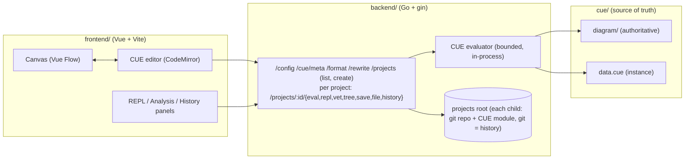

# cueto

> [!WARNING]
> Work in progress. This project is not production-ready. APIs, the schema, and storage formats change without notice.

A visual editor and evaluation server for diagrams whose single source of truth is CUE - the same value is drawn on a canvas, edited as code, and queried in a REPL.

## Why this exists

Diagrams drift from the domains they describe and carry no checkable meaning: they are pictures, not data. cueto explores the opposite premise - a diagram *is* data under a CUE schema. The shape, the constraints, and the domain facts are the same value, so "is this diagram valid?" and "what does it say?" become decidable by unification and evaluation instead of review by eye.

## What it demonstrates

- **Architecture pattern** - a hand-owned schema package (`cue/diagram/`) that is never machine-written, with a concrete instance (`data.cue`) overlaid per request; the canvas only ever round-trips the data, the schema stays authoritative.
- **Workflow design** - the same model is edited two ways (visual canvas and CUE code) kept in sync through a source map, then evaluated, validated, formatted, and saved to real files on disk in the user's own project, with git as the only history.
- **Knowledge model** - the schema separates rendering fields (`type`, `shape`, colors) from a free-form `data` payload, so the nodes you draw carry domain facts you can query.
- **Queryability** - a REPL pane with CUE stdlib introspection and autocompletion evaluates any expression against the live model in the editor.
- **Observability** - evaluation returns structured diagnostics with source positions and host paths scrubbed, plus provenance and hints, rather than opaque errors.
- **Production trade-offs** - untrusted CUE is evaluated in-process under body-size, output-size, per-request deadline, and concurrency bounds, behind explicit server timeouts and graceful shutdown.

## What it is not

This is not a production framework.
This is not a complete product.
This is a reference implementation / design study.

## Knowledge as code

The REPL pane turns the diagram into a queryable value. Every entry evaluates a CUE expression against the live model in the editor - nothing is saved, the schema and files are untouched - so a structured question gets a deterministic answer by evaluation, not retrieval.

Author a domain as data under a schema, and derive the graph from it:

```cue
package main

import d "github.com/stratorys/cueto/diagram"

#Person: {
	name:   string
	mother: string | *""
	father: string | *""
	role:   string | *""
	year:   int
}

people: [ID=string]: #Person
people: {
	george: {
		name: "George McFly"
		role: "parent"
		year: 1938
	}
	lorraine: {
		name: "Lorraine Baines"
		role: "parent"
		year: 1938
	}
	marty: {
		name:   "Marty McFly"
		role:   "traveler"
		mother: "lorraine"
		father: "george"
		year:   1968
	}
	dave: {
		name:   "Dave McFly"
		role:   "sibling"
		mother: "lorraine"
		father: "george"
		year:   1961
	}
	linda: {
		name:   "Linda McFly"
		role:   "sibling"
		mother: "lorraine"
		father: "george"
		year:   1965
	}
	doc: {
		name: "Dr. Emmett Brown"
		role: "inventor"
		year: 1920
	}
}

diagram: d.#Diagram & {
	nodes: {
		for pid, p in people {
			(pid): {
				type:  "entity"
				label: p.name
				data: {
					role: p.role
					year: p.year
				}
			}
		}
	}
	edges: [
		for pid, p in people if p.mother != "" {
			{
				id:     "m_\(pid)"
				source: p.mother
				target: pid
				kind:   "arrow"
				label:  "mother"
			}
		},
		for pid, p in people if p.father != "" {
			{
				id:     "f_\(pid)"
				source: p.father
				target: pid
				kind:   "arrow"
				label:  "father"
			}
		},
	]
}
```

Now "who is Marty's mother?" is a path lookup, not a guess. Type the expression in the REPL and evaluate it:

```
> people[people.marty.mother].name
"Lorraine Baines"
```

The answer comes from the compiled value: `marty.mother` is checked against the same schema that renders the graph, so a dangling name is a build error, not a hallucination. An agent wired to this endpoint answers from evaluated fact instead of retrieved text - the graph you draw and the knowledge you query are one CUE value. This is the [knowledge-as-code](https://stratorys.com/knowledge-as-code) bet applied to a single diagram.


## Architecture



## How it works

1. `cue/diagram/` is the hand-owned schema package (`#Diagram`, `#Node`, `#Column`, `#Edge`). It is never rewritten by the app.
2. `cue/data.cue` is the concrete instance that imports the schema and declares one or more diagram views. The canvas round-trips only this file; the schema stays fixed.
3. On `/eval`, the backend loads the module fresh from disk, overlays the request's editable files, and unifies them against the schema. It discovers every top-level field that is diagram-shaped (unifies with `#Diagram` and carries `nodes`) - a module may expose zero, one, or many such **views** - and returns the selected view's concrete diagram as JSON plus the list of discovered view names, or structured diagnostics on failure. A view must be concrete to render, so `/eval` gates it; non-view knowledge fields need only be valid. A module with zero views is a well-formed "no view" result, not an error. All under size, output, deadline, and concurrency bounds.
4. Canvas edits are spliced back into CUE text via `/rewrite`, and `/format` normalizes it with `cue fmt`, so the code and the picture never disagree.
5. `/repl` evaluates any CUE expression against the live model in the editor; `/cue/meta` exposes stdlib introspection that powers autocompletion and auto-import.
6. `/vet` validates every package in the module for validity (dangling references, schema and closedness violations) and returns structured diagnostics; it never requires concreteness, so an incomplete-but-valid module vets clean while `/eval` gates the rendered view. `make check` runs `cue vet ./...` plus `cueto vet` and `cueto check` (see [Command line](#command-line-ci)) so an invalid committed diagram - or a broken file/URI reference - fails CI.
7. Persistence is git. The server is pointed at a **projects root**; each child directory is a git repository with its own CUE module. `GET /projects` lists them and `POST /projects` creates one by git-initializing a new directory, scaffolding a minimal vocabulary-free module, and making one initial commit - the only time cueto ever writes git state. Every module-touching operation is scoped to a project: `/projects/:id/eval`, `/vet`, `/repl`, `/tree`, `/save`, `/file`, `/history`, and `DELETE /projects/:id/file`.
8. `/projects/:id/save` validates the buffer against the whole module and writes the real file on disk under a path guard, refusing a save when the file changed on disk since it was loaded and never staging, committing, or otherwise mutating git state. `/projects/:id/history` and `/projects/:id/file` read the git log and file blobs read-only to feed the history panel. cueto is not a version store; git is the only history.

## Command line (CI)

`cueto` is the CI and terminal face of the same engine the server runs, so the editor, CI, and (later) an agent can never disagree about whether a module is valid. From `backend/`, run it with `go run ./cmd/cueto` or build a binary with `go build ./cmd/cueto`. Every subcommand reads the module as committed on disk (no editor overlay) and exits nonzero on any diagnostic, so it drops straight into a CI step.

- `cueto vet -C <dir>` - **Layer 1**, pure-CUE validity of the whole module (dangling typed references, schema and closedness violations). This is the referential-integrity gate: constrain an owner to the key set of a people registry, and the module only compiles while that person exists.
- `cueto check -C <dir>` - **Layer 2**, the world-facing claims the compiler cannot decide. A field marked `@file()` must name a file that exists inside the module; a field marked `@uri()` must name a URI that resolves (`cue://` addresses resolve against the composed value, relative and `file://` against disk; `http(s)` is validated syntactically only - cueto never reaches the network).
- `cueto graph -C <dir> [-view <name>]` - print the discovered or inferred diagram as JSON, plus the inference trace.

`@file` and `@uri` are ordinary CUE attributes read by shape, exactly like the `@ref()` inference hint: they carry no cueto vocabulary and need no import, so a user's module stays `cue vet`-clean with nothing from cueto present. The two layers compose - CI runs `cueto vet` then `cueto check` - so a change that removes a person, breaks an owner reference, or points a readme at a missing file is rejected at the door.

## Run locally

Prerequisites: Go 1.26+, the [`cue`](https://cuelang.org) CLI (for `make check`), Node + pnpm.

Backend:

```
cp backend/.env.example backend/.env
cd backend
go run ./cmd/server
```

Set `PROJECTS_DIR` to a directory that holds your projects - each child is a git
repository with its own `cue.mod`. The web app lists them and creates new ones
(the first is made for you via `git init`); the diagram schema comes from `CUE_DIR`.

Frontend (in a second shell):

```
cp frontend/.env.example frontend/.env
cd frontend
pnpm install
pnpm run dev
```

Run the architecture CI check:

```
make check
```

Tests:

```
cd backend
go test ./...
```

```
cd frontend
pnpm run test
```

## Related writing

- [Coming soon](https://stratorys.com)

## License

Mozilla Public License v2.0 (MPL v2.0). See [LICENSE](LICENSE). Copyright 2026, Lucas Jahier - Stratorys.
