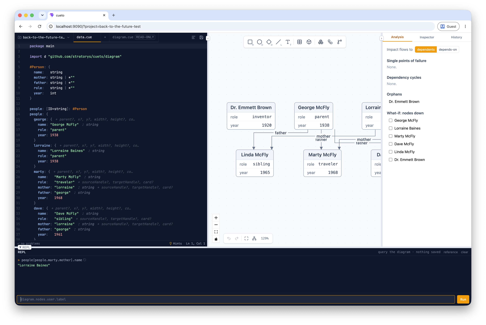
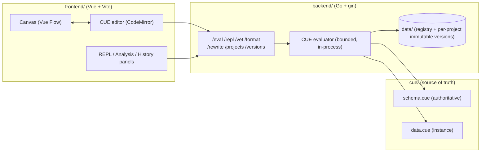

# cueto

> [!WARNING]
> Work in progress. This project is not production-ready. APIs, the schema, and storage formats change without notice.

A visual editor and evaluation server for diagrams whose single source of truth is CUE - the same value is drawn on a canvas, edited as code, and queried in a REPL.

## Why this exists

Diagrams drift from the domains they describe and carry no checkable meaning: they are pictures, not data. cueto explores the opposite premise - a diagram *is* data under a CUE schema. The shape, the constraints, and the domain facts are the same value, so "is this diagram valid?" and "what does it say?" become decidable by unification and evaluation instead of review by eye.

## What it demonstrates

- **Architecture pattern** - a hand-owned schema (`schema.cue`) that is never machine-written, with a concrete instance (`data.cue`) overlaid per request; the canvas only ever round-trips the data, the schema stays authoritative.
- **Workflow design** - the same model is edited two ways (visual canvas and CUE code) kept in sync through a source map, then evaluated, validated, formatted, and saved as immutable versions.
- **Knowledge model** - the schema separates rendering fields (`type`, `shape`, colors) from a free-form `data` payload, so the nodes you draw carry domain facts you can query.
- **Queryability** - a REPL pane with CUE stdlib introspection and autocompletion evaluates any expression against the live model in the editor.
- **Observability** - evaluation returns structured diagnostics with source positions and host paths scrubbed, plus provenance and hints, rather than opaque errors.
- **Production trade-offs** - untrusted CUE is evaluated in-process under body-size, output-size, per-request deadline, and concurrency bounds, behind explicit server timeouts and graceful shutdown.

## What it is not

This is not a production framework.
This is not a complete product.
This is a reference implementation / design study.

## Knowledge as code

The REPL pane turns the diagram into a queryable value. Every entry evaluates a CUE expression against the live model in the editor - nothing is saved, the schema and files are untouched - so a structured question gets a deterministic answer by evaluation, not retrieval.

Author a domain as data under a schema, and derive the graph from it:

```cue
package main

import d "github.com/stratorys/cueto/diagram"

#Person: {
	name:   string
	mother: string | *""
	father: string | *""
	role:   string | *""
	year:   int
}

people: [ID=string]: #Person
people: {
	george: {
		name: "George McFly"
		role: "parent"
		year: 1938
	}
	lorraine: {
		name: "Lorraine Baines"
		role: "parent"
		year: 1938
	}
	marty: {
		name:   "Marty McFly"
		role:   "traveler"
		mother: "lorraine"
		father: "george"
		year:   1968
	}
	dave: {
		name:   "Dave McFly"
		role:   "sibling"
		mother: "lorraine"
		father: "george"
		year:   1961
	}
	linda: {
		name:   "Linda McFly"
		role:   "sibling"
		mother: "lorraine"
		father: "george"
		year:   1965
	}
	doc: {
		name: "Dr. Emmett Brown"
		role: "inventor"
		year: 1920
	}
}

diagram: d.#Diagram & {
	nodes: {
		for pid, p in people {
			(pid): {
				type:  "entity"
				label: p.name
				data: {
					role: p.role
					year: p.year
				}
			}
		}
	}
	edges: [
		for pid, p in people if p.mother != "" {
			{
				id:     "m_\(pid)"
				source: p.mother
				target: pid
				kind:   "arrow"
				label:  "mother"
			}
		},
		for pid, p in people if p.father != "" {
			{
				id:     "f_\(pid)"
				source: p.father
				target: pid
				kind:   "arrow"
				label:  "father"
			}
		},
	]
}
```

Now "who is Marty's mother?" is a path lookup, not a guess. Type the expression in the REPL and evaluate it:

```
> people[people.marty.mother].name
"Lorraine Baines"
```

The answer comes from the compiled value: `marty.mother` is checked against the same schema that renders the graph, so a dangling name is a build error, not a hallucination. An agent wired to this endpoint answers from evaluated fact instead of retrieved text - the graph you draw and the knowledge you query are one CUE value. This is the [knowledge-as-code](https://stratorys.com/knowledge-as-code) bet applied to a single diagram.



## Architecture



## How it works

1. `cue/schema.cue` defines the diagram shape. It is hand-owned and never rewritten by the app.
2. `cue/data.cue` is the concrete instance. The canvas round-trips only this file; the schema stays fixed.
3. On `/eval`, the backend loads the schema fresh from disk, overlays the request's editable files, unifies them, and returns the concrete diagram as JSON - or structured diagnostics on failure - all under size, output, deadline, and concurrency bounds.
4. Canvas edits are spliced back into CUE text via `/rewrite`, and `/format` normalizes it with `cue fmt`, so the code and the picture never disagree.
5. `/repl` evaluates any CUE expression against the live model in the editor; `/cue/meta` exposes stdlib introspection that powers autocompletion and auto-import.
6. `/vet` validates the model against the schema and returns structured diagnostics; `make check` runs `cue vet ./...` so an invalid committed diagram fails CI.
7. Diagrams are grouped into projects (`/projects`); `/projects/:pid/save` writes the validated instance as an immutable, content-addressed version, and `/projects/:pid/versions` lists and reads them.

## Run locally

Prerequisites: Go 1.26+, the [`cue`](https://cuelang.org) CLI (for `make check`), Node + pnpm.

Backend:

```
cp backend/.env.example backend/.env
cd backend
go run ./cmd/server
```

By default the server runs in playground mode against `CUE_DIR`. Set `WORKSPACE_DIR`
to a directory with its own `cue.mod` to evaluate a user's module instead; the
diagram schema still comes from `CUE_DIR`.

Frontend (in a second shell):

```
cp frontend/.env.example frontend/.env
cd frontend
pnpm install
pnpm run dev
```

Run the architecture CI check:

```
make check
```

Tests:

```
cd backend
go test ./...
```

```
cd frontend
pnpm run test
```

## Related writing

- [Coming soon](https://stratorys.com)

## License

Mozilla Public License v2.0 (MPL v2.0). See [LICENSE](LICENSE). Copyright 2026, Lucas Jahier - Stratorys.
